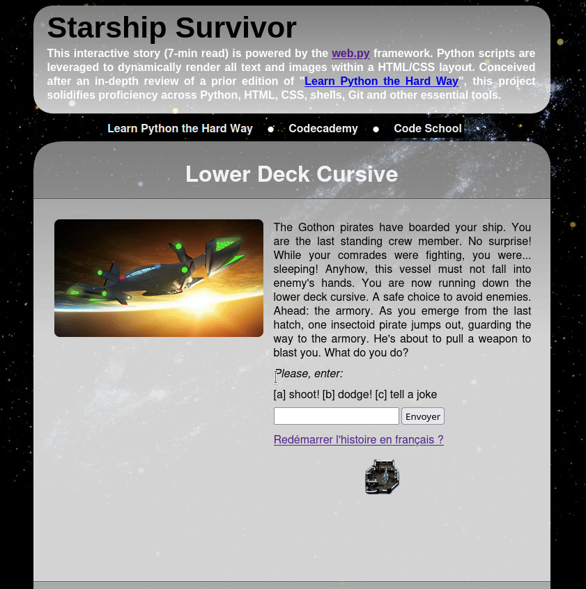
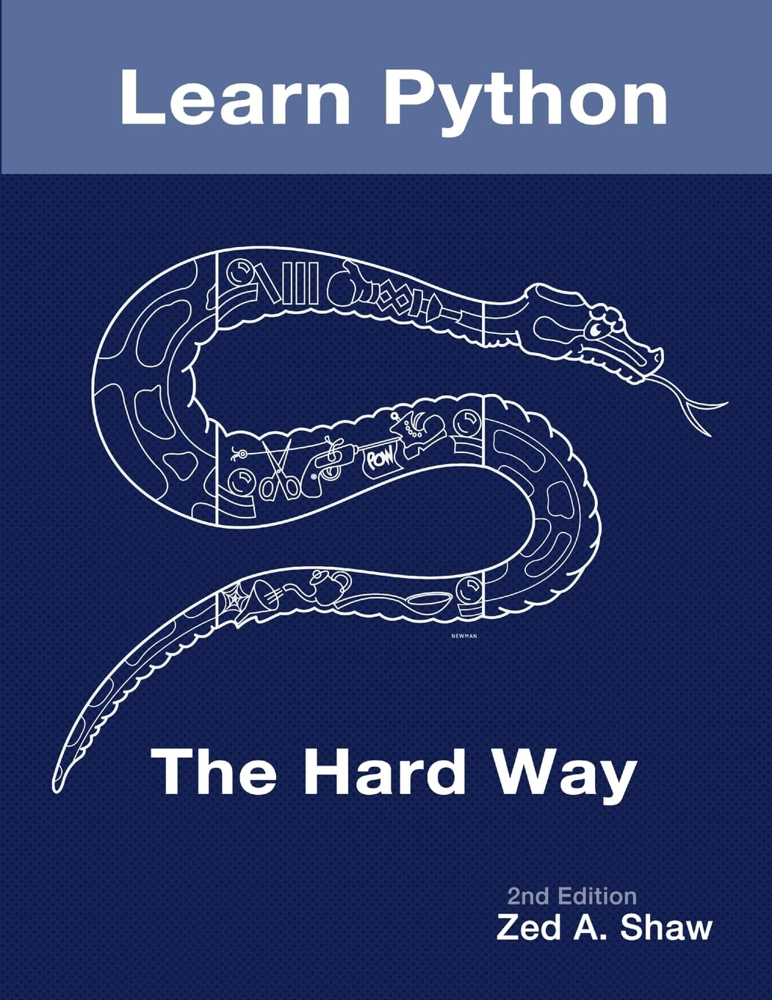
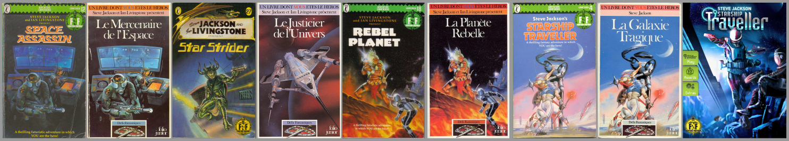

# web.py with Python 3.11

This interactive story (7-min read) is powered by the <a href="https://webpy.org/" target="_blank">web.py</a> framework. Python scripts are leveraged to dynamically render all text and images within a HTML/CSS layout. Conceived after an in-depth review of a prior edition of "<a href="https://learnpythonthehardway.org/" target="_blank">Learn Python the Hard Way</a>", this project solidifies proficiency across Python, HTML, CSS, shells, Git and other essential tools.

Hosted by <a href="https://ugolbo.pythonanywhere.com/" target="_blank">PythonAnywhere</a>.



## Project Setup and Structure

To run this interactive story locally, please ensure your environment meets the following requirements:

1. Clone the Repository: Begin by cloning the project files to your machine.
1. Environment: The application is built targeting Python 3.11 compatibility. It is confirmed to run on Python 3.10, which is the version currently used for deployment on PythonAnywhere.
1. Dependencies: Install the required web.py framework: `pip install web.py`.

### Directory Layout

The project utilizes a clear structure to separate the web engine, story logic and presentation assets.

```
───webpy_py311
    ├───bin
    ├───gothonmap
    ├───sessions
    ├───static
    │   ├───css
    │   └───img
    └───templates
```

Function: The core application engine ('bin/app.py') retrieves the narrative data from 'gothonmap/map.py', dynamically renders it using the HTML files in 'templates/' and applies styling via the assets in 'static/'. The 'sessions/' folder is essential for maintaining user progress throughout the interactive story.

## Running the Application

To launch the web application, follow these simple steps:

1. Navigate: Ensure your terminal is at the root directory of the project (webpy_py311/).
1. Execute: Run the main application file using your Python executable: `python bin/app.py`
    - Note: Depending on your OS setup, you may need to use `py -3 bin/app.py` or `python3 bin/app.py`.
1. Access: The terminal will display the local server address, typically `http://0.0.0.0:8080/`. Copy this URL and paste it into your web browser.
1. Dependencies: Please note that standard VPNs and ad blockers should not interfere with accessing the site locally.

### Troubleshooting: PYTHONPATH Errors

If the Python script fails to launch or reports that it cannot find modules (like `gothonmap`), you likely have a `PYTHONPATH` issue. The interpreter needs to be told where to look for the project's internal libraries.

Execute the appropriate command below in your terminal before you run python `bin/app.py` again:

- For Linux/macOS: `export PYTHONPATH=$PYTHONPATH:.`
- For Windows (PowerShell): `$env:PYTHONPATH = "$env:PYTHONPATH;."`

Alternatively, the site is ready to be run in a virtual environment and can be easily configured for online hosting.

Have fun!

# Project Origins and Modernization

This project originated from the blueprint provided in the outdated "<a href="https://cglab.ca/~morin/teaching/1405/lpthw/book/" target="_blank">Learn Python the Hard Way, 2nd edition</a>" (2011), which was based on a legacy stack: Python 2.5.1 and an older version of the web.py framework. The initial design was a simple, single-language website.



The undertaking was significantly expanded through the implementation of a bilingual mode and the integration of substantial additional imagery. The most profound technical challenge, however, was the decision to migrate the entire codebase to Python 3.11, completely modernizing the deprecated code proposed in the 2011 source material.

This approach intentionally diverges from the book's subsequent evolution: later editions (3rd edition, 2014,  and 4th edition, 2017) modernized the web project by switching to the Flask framework in Python 3.6.0. The most recent iteration, the 5th edition (2024), has since abandoned web development entirely, focusing instead on Data Science. By choosing to retrofit and update the original web.py concept with Python 3.11, this project aimed for a unique exercise in legacy code modernization and technical adaptation.

# The Concept of Interactive Stories

The heyday of branching-path novels, also known as <a href="https://en.wikipedia.org/wiki/Gamebook" target="_blank">gamebook</a>, flourished just before the rise of the Internet in the early 1990s. The core principle mirrors website navigation: the reader browsed through the book much like clicking through pages. Each numbered paragraph offered choices that led to other corresponding numbered paragraphs. Instead of following a hyperlink, the reader would physically flip the pages to the new section, advancing through an adventure defined by combats, challenges and enigmas.

Highly popular throughout the 1980s and 1990s, these fantasy and futuristic fictions were translated into over <b>3030 languages</b> and sold more than <b>17 million books</b> worldwide.



Originally published on paper, these <a href="http://gamebooks.org/" target="_blank">stories</a> have found a new life on mobile devices. Nowadays, many classical and original stories are available on both iOS and Android. However, while it was easy to cheat with the printed books, doing so is much harder with the mobile applications.

# The Brutalist Aesthetic

Web design that deliberately takes its cues from 1990s graphics and early web aesthetics is often categorized using terms like Neo-Geocities, Web 1.0 Revival, or the most common, Brutalism. This philosophy embraces a raw, "no frills" approach, aiming for weightlessness and simplicity. The Brutalist aesthetic is characterized by rawness, simple markup, plain typography, a lack of modern optimization and often a deliberate lack of user-friendliness. This focus on direct function over sleek form aligns perfectly with the underlying philosophy of the <a href="http://webpy.org/" target="_blank">web.py</a> framework.
